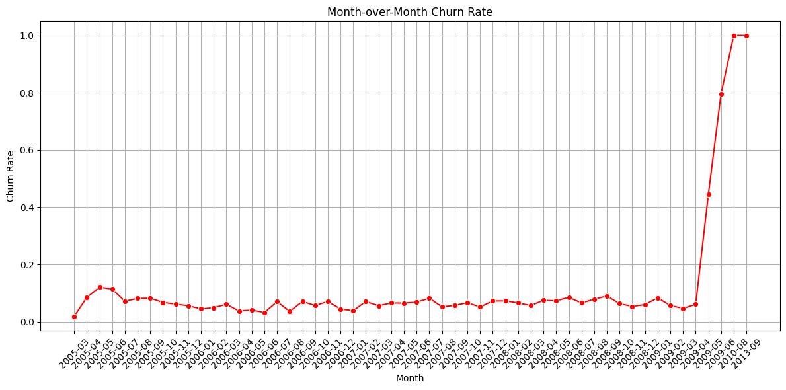
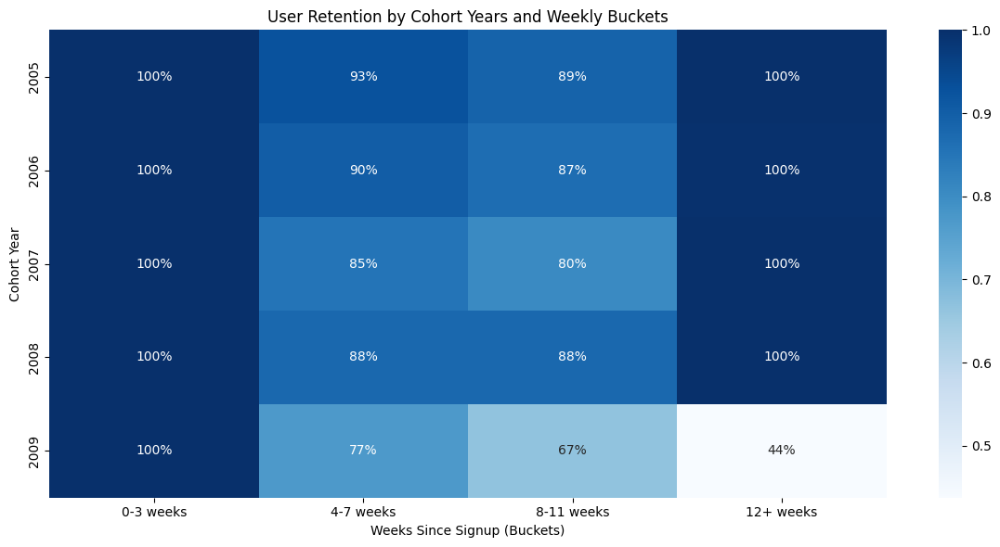

Spotify-Style Listener Churn and Retention Analysis

I analyzed a 19 million record Last.fm dataset to simulate Spotify user behavior. This helped reveal listener churn trends, artist-based retention, and cohort-based engagement patterns.

## Project Highlights
- Calculated monthly churn rate and tracked Weekly Active Users (WAU) over time
- Built cohort heatmaps to visualize user retention from 2005 to 2010
- Identified the artists with the highest retention: Muse, Radiohead, Coldplay, The Beatles, Nine Inch Nails
- Detected a significant churn spike after March 2009, increasing from about 10% to 45%

## Visuals
| Churn Rate Over Time | User Retention Heatmap |
|----------------------|--------------------------|
|  |  |

## Tools Used
- Python (Pandas, NumPy, Matplotlib, Seaborn)
- Google Colab
- Dataset: [Last.fm 1K User Dataset](https://zenodo.org/records/6090214)

## Folder Structure
- `user_retention_churn_analysis.ipynb`: Full notebook code
- `plots/`: Output graphs and heatmaps
- `data/`: dataset.tar.gz